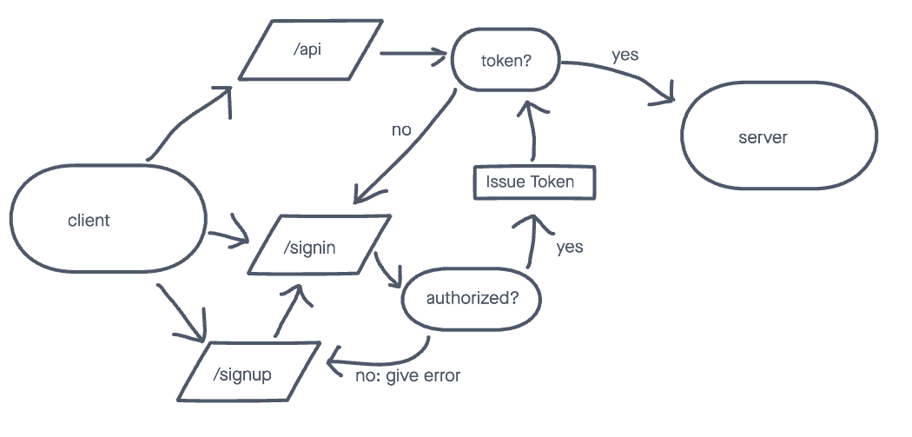

# bearer-auth

Created by Evan Woodworth

## Additional Security Measures Implemented

I added an expiration to JWT:

```js
jwt.sign({ username: this.username }, SECRET, { expiresIn: '15m' })
```

## Links to application deployment

Heroku: https://evans-bearer-auth.herokuapp.com/  
Github Pull Request: https://github.com/evan-woodworth/bearer-auth/pull/1

## UML

